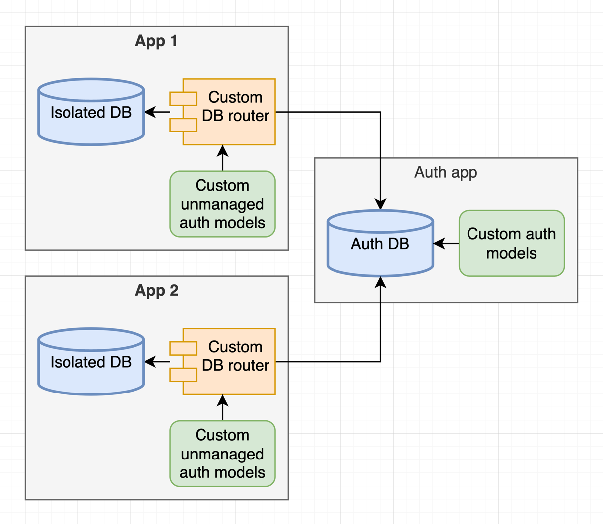

# Django microservice core

---

### This project helps to develop microservices with Django Framework. No more hundreds of apps in one project. Split every app into separate project. That helps to develop more flexible and scalable projects.

---

> #### Note: First of all this is simple Django project with some customizations. If you are newbie in Django, you can use this project as a template for your own projects. I'm not very cool in programming, but I have some experience in Python and Django and want to share it with you.

---

> #### Not ready for production. Will be ready with version 1.0.0

---

## How it works

  

---

## Features
- [x] Expiring token authentication
- [x] Custom user model
- [x] Custom db router for auth models
- [x] Static and media files served by Nginx
- [ ] Message brokers integration
- [ ] Kubernetes integration
- [ ] Full documentation
- [ ] Email confirmation
- [ ] Active directory authentication
- [ ] Cloud storage integration
- [ ] Centralized logging
- [ ] Centralized monitoring
- [ ] Automatic discovery of microservices

---

## Requirements
- [Docker with docker compose](https://docs.docker.com/compose/install/)

---

## Installation

### [Run locally using docker compose](docs/run_locally_using_docker_compose.md)

### [Deploy to server using docker compose](docs/deploy_to_server_using_docker_compose.md)

---

## Examples
You can find example microservice app under [forks](https://github.com/dj-ms/dj-ms-core/network/members) section.
Also, there is an example microservice app: [dj-ms-example-app](https://github.com/dj-ms/dj-ms-example-app).

